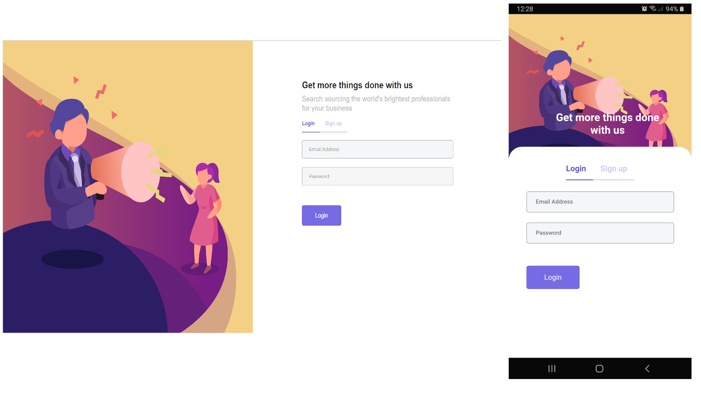

This project was bootstrapped with [Create React App](https://github.com/facebook/create-react-app) and Bootstrap UI

It uses Sass (with .scss).

Dependencies are handled by **yarn**.

## Usage
`yarn install` - to install dependencies

## Sctipts 
`yarn start` Runs the app in the development mode.\ 
`yarn build` Builds the app for production to the `build` folder.\ 
